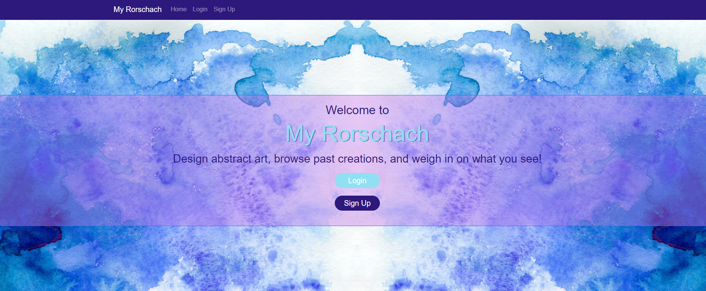

  # My Rorschach

  

  ## Description

  An art website, where you can create mirrored drawings and conversate with other users about your work!

  ## Table of Contents
  * [Installation](#installation)
  * [Usage](#usage)
  * [Contributors](#contributors)
  * [Tests](#tests)
  * [Questions](#questions)
  * [Link](#link)
  * [Screenshot](#screenshot)
  
  ## Installation

  clone the repo and then run npm run install in the console

  ## Usage

  Head to the website and follow the directions.
  

  ## Contributors

  Benjamin Huffman  
  Christa Newing  
  Leandri Beavis  
  Brendan Kersey  
  
  ## Tests 

  No testing required.
  
  ## Questions
  Questions? Comments? Concerns? Feel free to reach out!  
  Email: none  
  GitHub: [BenHuf](https://github.com/BenHuf)  
  
  ##Link
  [MyRorschach](www.myrorschach.com)

  ##Screenshot

  